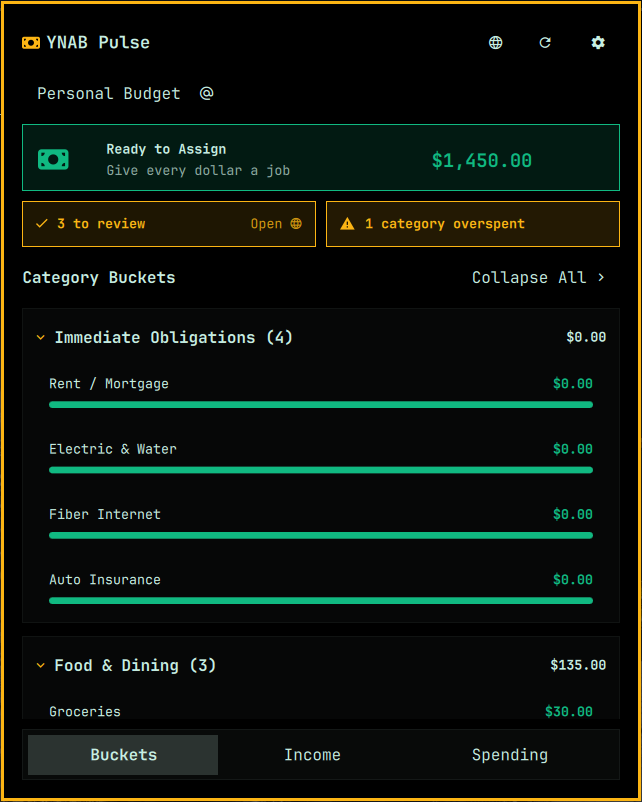

# YNAB Pulse (Omarchy Plugin)

A fast, private, and beautiful **You Need A Budget (YNAB)** companion for the Omarchy Linux desktop shell.

- **Plugin Name**: `YNAB Pulse`
- **Plugin ID**: `io.github.elevate08.ynab-glance`



---

## Key Features

- **At-a-Glance Budget Buckets**:
  - **Ready to Assign Banner**: Displays current available funds to assign with quick-launch to YNAB.
  - **Action Alerts**: Live pill badges highlighting unapproved transactions to review and overspent categories.
  - **Category Buckets & Progress**: Collapsible category groups with progress bars adhering to official YNAB conventions (Green funded, Amber/Yellow underfunded, Red overspent).
- **Income, Age of Money & 6-Month Trend Graph**:
  - **Age of Money Tracker**: Days metric with status health badge.
  - **Current Month Inflow vs. Outflow**: Total Income, Spending, Net Savings, and Savings Rate %.
  - **Multi-Month Historical Trends**: Side-by-side Income vs. Spending dual-bar chart with interactive hover tooltips across the last 6 months.
- **Interactive Spending Analysis**:
  - **Doughnut Pie Chart**: High-DPI canvas visualization of monthly expenses by Category Group.
  - **Category Group Drill-Down**: Click any pie slice or group row to drill down into sub-category spending outflows, budgeted amounts, remaining balances, and progress bars.
- **Fast & Private Rust Backend**:
  - Sub-millisecond execution with native caching and zero Python runtime dependencies.
  - **Doubly Encrypted Token Storage**: Your Personal Access Token is sealed with XChaCha20-Poly1305 under a key generated for your install, and only the envelope goes into the Linux Secret Service (`org.freedesktop.secrets` / GNOME Keyring / KWallet). A program that dumps your keyring gets ciphertext. Survives reboots.
- **Settings & Multi-Budget Management**:
  - **Active Budget Selector**: Full-width dropdown to switch between multiple budgets instantly.
  - **Background Refresh Interval Slider**: Easily configure background polling from 1 to 72 hours directly inside the UI.
  - **Keyring Token Management**: Check connection status, access developer settings, or revoke tokens safely.

---

## Keyboard Shortcuts

All navigation and actions can be operated entirely via keyboard with the `Alt` modifier:

| Shortcut | Action |
| :--- | :--- |
| **`Alt+1`** / **`Alt+B`** | Switch to **Buckets** tab (Budget categories & overspent alerts) |
| **`Alt+2`** / **`Alt+I`** | Switch to **Income** tab (Age of money & 6-month trends) |
| **`Alt+3`** / **`Alt+P`** | Switch to **Spending** tab (Pie chart breakdown) |
| **`Alt+D`** | Toggle **Spending Drill-down** (inspect sub-category details) |
| **`Alt+M`** / **`Alt+U`** | Open **Active Budget Selector** dropdown |
| **`Alt+S`** / **`Alt+,`** | Toggle **Settings** panel (slider, budgets, security) |
| **`Alt+R`** | Trigger immediate **Force Refresh** from YNAB |
| **`Alt+W`** / **`Alt+O`** | Launch **YNAB Web App** in your default browser |
| **`Alt+C`** / **`Enter`** | Save & Connect token on the onboarding screen |
| **`Escape`** | Step back from drill-down / close dropdown / close panel |

---

## Status Bar Mouse Controls

- **Left-Click**: Toggle open/close the YNAB Pulse panel.
- **Middle-Click**: Trigger an immediate background fetch from YNAB.
- **Right-Click**: Send a desktop notification summary with Ready to Assign and Age of Money.

---

## Installation & Setup

1. **Install and enable the plugin with Omarchy**:
   ```bash
   omarchy plugin add https://github.com/Elevate08/qs-ynab-api.git --enable
   ```

   Omarchy validates the plugin manifest, installs the repository under the
   correct plugin ID, and enables the widget. Choose the right bar section if
   prompted; the plugin also declares `right` as its default placement.

   That single command is all it takes: the Rust helper (`bin/ynab-cli`) is
   prebuilt by this repository's CI and ships inside the plugin, so no toolchain
   is required on your machine. Plugin updates deliver new helper builds the
   same way.

2. **Connect your YNAB Account**:
   - Generate a Personal Access Token in [YNAB Account Settings > Developer](https://app.ynab.com/settings/developer).
   - Click the bar widget, paste your token, and click **Save & Connect**.

   To set the token from a terminal instead, pipe it in — it is deliberately not
   accepted as an argument, so it stays out of `/proc` and your shell history:
   ```bash
   cd ~/.config/omarchy/plugins/io.github.elevate08.ynab-glance
   ./bin/ynab-cli auth set < /path/to/token.txt   # or: pass show ynab | ./bin/ynab-cli auth set
   ```

---

## Building or verifying the helper

Every `bin/ynab-cli` in this repository is produced by GitHub Actions:
`ci.yml` compiles it from source and commits it to `main`
(`ci: bundle ynab-cli from <sha>`, naming the exact source it was built from),
and tagged releases attach their own
build plus `SHA256SUMS`. Nothing is ever uploaded by hand. If you would rather
not take that on faith:

**Verify what you have**

```bash
PLUGIN=~/.config/omarchy/plugins/io.github.elevate08.ynab-glance

# Sigstore provenance: was this exact byte stream built by CI from this repo?
gh attestation verify "$PLUGIN/bin/ynab-cli" --repo Elevate08/qs-ynab-api

# Checksum: compare against SHA256SUMS on the latest release page.
sha256sum "$PLUGIN/bin/ynab-cli"
```

**Build it yourself**

```bash
cd ~/.config/omarchy/plugins/io.github.elevate08.ynab-glance
./build.sh
```

Needs a Rust toolchain and the D-Bus development headers (`dbus` on Arch,
`libdbus-1-dev` on Debian/Ubuntu) - the helper talks to the Secret Service
over D-Bus to store your token. A running Secret Service provider (GNOME
Keyring, KWallet, KeePassXC) must be available at runtime.

Two notes for the source-build route:

- Your build replaces the CI one until you restore it with
  `git restore bin/ynab-cli`.
- A locally modified `bin/ynab-cli` blocks `omarchy plugin update`
  (fast-forward merges refuse dirty trees) - run `git restore bin/ynab-cli`
  first, or remove your build and let the update bring the fresh CI bundle.

See [SECURITY.md](SECURITY.md) for the full trust discussion behind shipping a
prebuilt helper.

**Running the tests**

```bash
cargo test --manifest-path backend/Cargo.toml   # the helper (./build.sh runs this too)
./tests/run.sh                                  # the panel's QML helpers (needs node)
```

`tests/run.sh` discovers every `tests/*.test.js`, and CI runs the same script,
so a new suite is picked up in both places without either being edited. The
suites assert the security properties SECURITY.md claims - that remote names
cannot reach Qt's rich-text renderer, and that no list from the API can be
handed to a `Repeater` unbounded - so a failure there is a regression in the
threat model, not a style nit.

---

## Security Model

- **Zero Plaintext Secrets**: Personal Access Tokens are encrypted with a per-install key before they reach the system's Secret Service, so the keyring holds an envelope rather than the token. The key lives in `~/.local/share/io.github.elevate08.ynab-glance/token.key` (0600) and is destroyed when you revoke. Nothing is ever written to a dotfile. See [SECURITY.md](SECURITY.md) for what this does and does not defend against.
- **No Token in `argv`**: The token is piped to the helper over stdin and never passed as a command-line argument, where `/proc/<pid>/cmdline` would expose it to every local process. `ynab-cli auth set` refuses an argument outright.
- **Encrypted Offline Cache**: The cached overview in `~/.cache/io.github.elevate08.ynab-glance/` is sealed with the same per-install key as your token, so the file on disk is an envelope rather than readable JSON. It uses strict `0600` permissions in a `0700` directory, is ignored on read if it is not a private regular file, and is deleted rather than displayed if it fails its authentication tag.
- **Revoke Means Erase**: Clearing the token also deletes the locally cached financial data.
- **Minimal Network Surface**: HTTPS-only requests to `https://api.ynab.com/v1/` with certificate verification, a 10s timeout, and redirects refused so the bearer token can never be replayed to another host.

See [SECURITY.md](SECURITY.md) for the full threat model, trust boundaries, and known limitations.

---

## License

MIT License. See [LICENSE](LICENSE) for details.
